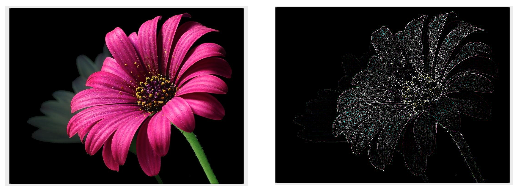

## 1. What are Channels and Kernels(According to EVA)?

## Channels

 I would say channels are different building blocks of a perticular image. 
for example:
if you consider a coloured image it contains 3 seperate channels called Red, blue, green. Not only this 
there other components like edges and gradients are also treated as channels. Fig 1.2(edges) shows one such channel here. To fetch all these different channels we use kernels/filters. The operation of fetching channels/feature maps is known as convolution.

## Kernels/filters: 

Kernals are used to extract different features from a image by convolving on top of the image. Kernel is a small matrix which can be used to perform many operations on an Image. The kernel can be of any size i.e., 3x3, 5x5, 7x7 etc. 

Using kernel we can extract features like vertical edges, horizontal edges, gradients etc. Kernals are also used in blurring, sharpening, edge detection. Following code uses a kernel which works as edge extractor of the image.

```python
import cv2
import numpy as np
#your image
img = cv2.imread(r'Path\\*.png')
'''
Edge detection Kernal
-1 -1 -1 
-1  8 -1
-1 -1 -1
'''
x = [[-1,-1,-1],[-1,8,-1],[-1,-1,-1]]
kernel = np.asarray(x)
output_image = cv2.filter2D(img,-1,kernel)
cv2.imwrite(r'Path\\blurred.png',output_image) 

```




​                                                             Fig 1.1                                                      Fig 1.2

The above images shows the image before and after applying edge detection filter.​                               


## 2. Why should we only (well mostly) use 3x3 Kernels?

Most of the time we prefer 3x3 kernals because using multiple 3x3 kernals we can reproduce effect of convolution operation by kernels of different sizes.

for example:

1) The effect of convolution operation  operation by 5x5 is replicated by convolving an image twice using  two 3x3 kernels. similerly effect of 7x7 kernel by three 3x3 kernels and so on.

Because of this salient property of 3x3 kernels many of the algorithms, gpu computations are optimized for 3x3 kernels.  


## 3. How many times do we need to perform 3x3 convolution operation to reach 1x1 from 199x199 (show calculations).

Each time we perform a convolution operation on image, the size of the image is reduced by 2x2 i.e, if the image size is 11x11 after one convolution operation using 3x3 kernel the size is reduced to 9x9.

if the image size is 199x199 to we need to perform 99 convolution operations to reach 1x1.

#### Calculation:

Assuming the image has only one channel.

 199 x 199 x 1 | 3x3x1| 197 x 197 x 1

 197 x 197 x 1 | 3x3x1| 195 x 195 x 1

 195 x 195 x 1 | 3x3x1| 193 x 193 x 1

​                           ……...

5 x 5 x 1           | 3x3x1|         3 x 3 x 1      …… 98th convolution

3 x 3 x 1           | 3x3x1|         1 x 1 x 1.     …… 99th convolution


 